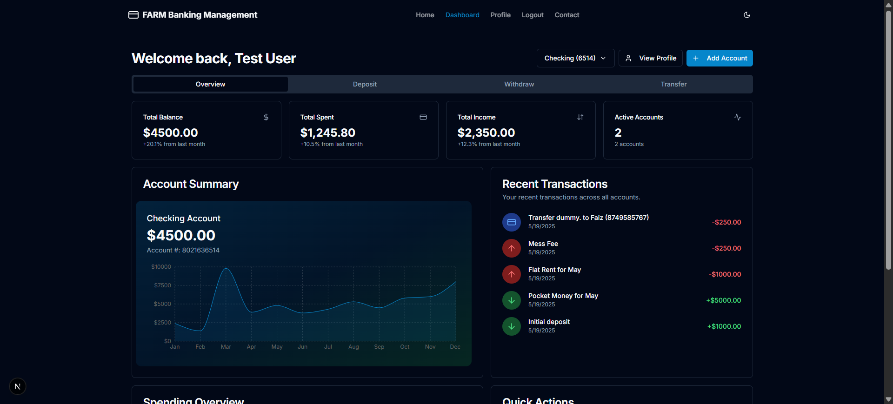
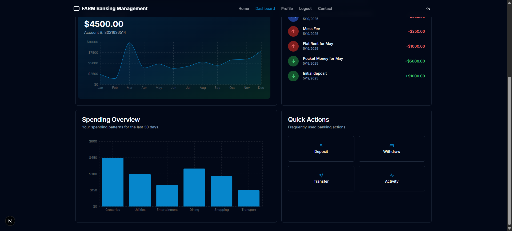

Here's a comprehensive `README.md` file for your Banking Management System project in Markdown format:


# 🏦 Banking Management System (Frontend Only)

A modern, responsive banking application built with **React.js** and **Tailwind CSS**, featuring dummy data simulation and localStorage persistence. No backend required!

 
<!-- Add your screenshot here -->
## Screenshots
<table>
  <tr>
    <td></td>
    <td></td>
  </tr>
  <tr>
    <td></td>
    <td></td>
  </tr>
  <tr>
    <td></td>
    <td></td>
  </tr>
  <tr>
    <td></td>
    <td></td>
  </tr>
</table>
## ✨ Features

- 💳 **User Authentication** (Mock JWT)
- 📊 **Interactive Dashboard** with account summary
- 💸 **Transaction Management** (Deposit/Withdraw/Transfer)
- 👤 **Profile Management** with photo upload
- 📝 **Contact Form** with localStorage persistence
- 📑 **Legal Pages** (Terms & Conditions, Privacy Policy)
- 🌓 **Dark/Light Mode** toggle
- 📱 **Fully Responsive** design
- ⚡ **Optimistic UI Updates**

## 🛠️ Technologies Used

- 
- 
- 
- 

## 🚀 Getting Started

### Prerequisites
- Node.js (v16+ recommended)
- npm (v8+ recommended)

### Installation
1. Clone the repository:
   ```bash
   git clone https://github.com/yourusername/banking-system.git
   ```
2. Navigate to project directory:
   ```bash
   cd banking-system
   ```
3. Install dependencies:
   ```bash
   npm install
   ```

### Available Scripts
- Start development server:
  ```bash
  npm start
  ```
- Build for production:
  ```bash
  npm run build
  ```
- Run tests:
  ```bash
  npm test
  ```

## 📂 Project Structure
```
banking-system/
├── public/               # Static files
├── src/
│   ├── assets/           # Images, icons
│   ├── components/       # Reusable components
│   ├── data/             # Dummy data files
│   ├── pages/            # Application pages
│   ├── styles/           # Custom styles
│   ├── utils/            # Utility functions
│   ├── App.js            # Main application
│   └── index.js          # Entry point
├── package.json
└── README.md
```

## 🔒 Mock Authentication
Use these test credentials:
- **Email:** test@bank.com
- **Password:** 123456

## 📝 Data Persistence
All data is stored in `localStorage` including:
- User profile information
- Transaction history
- Contact form submissions
- UI preferences (theme)

## 🤝 Contributing
Contributions are welcome! Please follow these steps:
1. Fork the project
2. Create your feature branch (`git checkout -b feature/AmazingFeature`)
3. Commit your changes (`git commit -m 'Add some AmazingFeature'`)
4. Push to the branch (`git push origin feature/AmazingFeature`)
5. Open a Pull Request

## 📄 License
Distributed under the MIT License. See `LICENSE` for more information.


Made with ❤️ by Faizuddin <!-- Add your demo link -->
